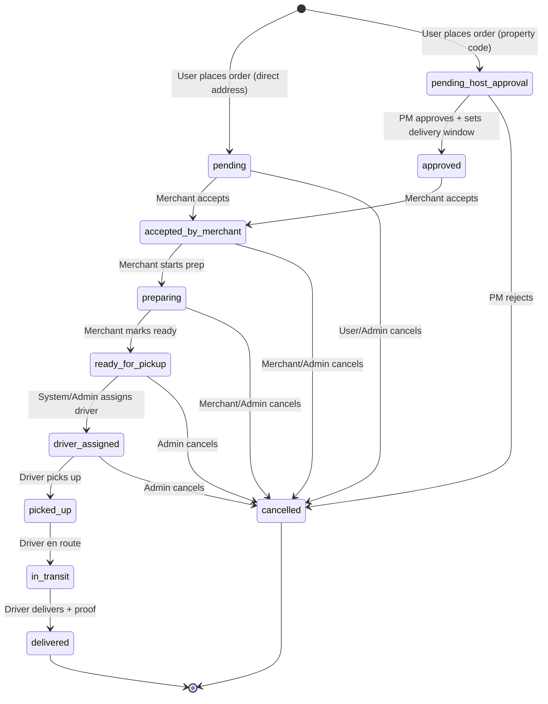

# Fridge Fillers (Happypphoto) — Full Implementation Plan

> **Generated**: 2026-06-27  
> **Backend Stack**: Node.js · Express 5 · TypeScript · Mongoose · MongoDB  
> **Real-Time**: Socket.IO (chat + driver location only)  
> **Payments**: Stripe  

---

## 0. PROPERTY_HOST Role — Verified Understanding

Based solely on [Property_host_role.md](file:///C:/Users/thakursaad/projects/happyphoto/docs/Property_host_role.md):

The **PROPERTY_HOST** (referred to as "Property Manager" or "PM" in the doc) is a **short-term rental host** (e.g., Airbnb/VRBO host) who acts as a **gatekeeper** between their guest (the USER/customer) and the delivery service. The defining workflow is:

1. **Property Setup** — PM registers, adds their rental property's **physical address**. The system generates a **unique 5–7 digit Property Code** for that address. The PM shares this code with their guest **outside the platform** (via Airbnb/VRBO messaging).

2. **Customer Ordering** — The guest (USER) enters the Property Code in the app's address field instead of a physical address. They browse stores, build a cart, and place an order. The order goes into a **"Pending Host Approval"** state — it does NOT immediately route to a merchant or driver.

3. **PM Approval** — The PM receives a notification about the delivery request. They review it and **set a Delivery Window** (e.g., "Monday, 2:00 PM – 4:00 PM") and **Stay Dates**. They then approve the order.

4. **Fulfillment** — Only after PM approval does the order become visible to the **Driver** ("Chopper"). **Only at this point** is the physical address revealed to the driver for navigation. The driver delivers within the PM's specified window.

**Key principles:**
- The physical address is **never exposed** to the customer or driver until PM approval
- The Property Code is the **only identifier** the customer uses — it acts as a privacy-preserving proxy for the real address
- Each code is **permanent** and tied to one specific address
- The PM controls **when** deliveries happen via the delivery window
- This creates a unique order state machine with an extra "Pending Host Approval" gate

---

## 1. Project Overview

### 1.1 Platform Description

Fridge Fillers is a **multivendor food/grocery delivery platform** targeting the **short-term rental market**. What makes it unique is the PROPERTY_HOST role: rental hosts can register their properties, generate privacy-preserving codes, and control delivery schedules to their rental units — keeping their physical addresses private until the moment of delivery.

### 1.2 Confirmed Tech Stack (from codebase)

| Layer | Technology | Version |
|-------|-----------|---------|
| Runtime | Node.js | — |
| Language | TypeScript | 6.x |
| Framework | Express.js | 5.2.x |
| Database | MongoDB | — |
| ODM | Mongoose | 9.3.x |
| Auth | JWT (jsonwebtoken) + bcrypt | 9.x / 6.x |
| Real-Time | Socket.IO | 4.8.x |
| Payments | Stripe | 20.x |
| Email | Nodemailer | 8.x |
| File Upload | Multer | 2.x |
| Logging | Winston + Daily Rotate File | 3.x / 5.x |
| Cron | node-cron | 4.x |
| Validation | validator.js | 13.x |
| Rate Limiting | express-rate-limit | 8.x |
| Templating | EJS | 5.x |

### 1.3 Roles & Core Responsibilities

| Role | Responsibility |
|------|---------------|
| **USER** | End consumer / rental guest. Browses stores, adds items to cart, enters Property Code as address, places orders, tracks delivery, leaves reviews, chats with drivers. |
| **PROPERTY_HOST** | Short-term rental host. Registers properties with physical addresses, generates unique property codes, shares codes with guests, approves/schedules deliveries, manages delivery windows and stay dates. |
| **DRIVER** ("Chopper") | Delivery agent. Receives approved orders, views delivery address (only after PM approval), picks up from merchant, delivers within the specified window, provides proof of delivery, broadcasts live location. |
| **MERCHANT** | Store/restaurant owner. Manages store profile, creates/updates product menu, receives and fulfills orders, manages business info and documents. |
| **ADMIN** | Platform administrator. Manages all users, approves drivers/merchants, handles content (T&C, Privacy, FAQ, About, Contact), views analytics, manages disputes. |

---

## 2. Design System & UI Tokens

> **⚠️ LIMITATION**: The Figma files require authenticated browser access and JavaScript rendering to extract actual design content. The URLs reference the project **"Happypphoto || Food Delivery App"** (Figma file ID: `4RTwFj2j4rr4e8p2xoYPUb`). The following is inferred from the project name, branding found in code (email templates use `#b26a7b`), and standard food delivery app patterns.

### 2.1 Color Palette (Inferred + Email Template)

| Token | Value | Usage |
|-------|-------|-------|
| Primary | `#b26a7b` | Brand accent (confirmed from email templates) |
| Primary Dark | `#8e4f5f` | Buttons, active states |
| Primary Light | `#d4a0ae` | Backgrounds, highlights |
| Background | `#FFFFFF` | Main background |
| Surface | `#F8F9FA` | Card backgrounds |
| Text Primary | `#1A1A2E` | Headings, body text |
| Text Secondary | Per `EMAIL_TEMP_TEXT_SECONDARY_COLOR` env var | Subtitles, metadata |
| Success | `#28A745` | Order confirmed, delivery complete |
| Warning | `#FFC107` | Pending states |
| Error | `#DC3545` | Errors, cancellations |
| Info | `#17A2B8` | Informational badges |

### 2.2 Typography

| Level | Font | Weight | Size |
|-------|------|--------|------|
| H1 | TBD from Figma | Bold (700) | 28px |
| H2 | TBD from Figma | Semi-Bold (600) | 24px |
| H3 | TBD from Figma | Semi-Bold (600) | 20px |
| Body | TBD from Figma | Regular (400) | 16px |
| Caption | TBD from Figma | Regular (400) | 12px |
| Button | TBD from Figma | Medium (500) | 16px |

> **Action Required**: Extract exact font families, sizes, and weights from Figma once access is available.

### 2.3 Spacing System

Standard 4px grid: `4, 8, 12, 16, 20, 24, 32, 40, 48, 64`

### 2.4 Icon Set

To be confirmed from Figma. Likely a standard set (Feather, Phosphor, or custom SVGs).

### 2.5 Component Library

Standard mobile-first components expected: Cards, Buttons, Input Fields, Bottom Sheets, Modals, Tab Bars, Search Bars, Steppers, Map Views, Rating Stars, Badge Counters, Avatar Components.

---

## 3. Database Schema

### 3.1 Existing Models

#### 3.1.1 Auth (`auths`)

| Field | Type | Required | Default | Constraints | Notes |
|-------|------|----------|---------|-------------|-------|
| `_id` | ObjectId | auto | — | — | — |
| `name` | String | ✅ | — | — | — |
| `email` | String | ✅ | — | unique, validator.isEmail | — |
| `password` | String | ✅ | — | `select: false` | bcrypt-hashed via pre-save |
| `role` | String | ✅ | — | enum: USER, PROPERTY_HOST, DRIVER, MERCHANT, ADMIN | — |
| `isVerified` | Boolean | ❌ | — | — | For password reset flow |
| `isBlocked` | Boolean | ❌ | `false` | — | Admin can block users |
| `isActive` | Boolean | ❌ | `false` | — | Activated after OTP |
| `verificationCode` | String | ❌ | — | — | Password reset OTP |
| `verificationCodeExpire` | Date | ❌ | — | — | — |
| `activationCode` | String | ❌ | — | — | Signup activation OTP |
| `activationCodeExpire` | Date | ❌ | — | — | — |
| `createdAt` | Date | auto | — | — | timestamps |
| `updatedAt` | Date | auto | — | — | timestamps |

**Statics**: `isAuthExist(email)`, `isPasswordMatched(given, saved)`  
**Pre-save Hook**: Hashes password on modification

#### 3.1.2 User (`users`) — Polymorphic "God Model"

> **⚠️ SCHEMA CONCERN**: Currently holds fields for ALL non-admin roles (USER, PROPERTY_HOST, DRIVER, MERCHANT) in a single collection. While this simplifies queries, it creates a sparse document problem. Recommended to keep for now (no over-engineering) but add role-specific validation.

| Field | Type | Required | Default | Role-Specific | Ref |
|-------|------|----------|---------|--------------|-----|
| `authId` | ObjectId | ✅ | — | All | Auth |
| `name` | String | ✅ | — | All | — |
| `email` | String | ✅ | — | All | — |
| `role` | String | ✅ | — | All (enum) | — |
| `profile_image` | String | ❌ | — | All | — |
| `phoneNumber` | String | ❌ | — | All | — |
| `dateOfBirth` | String | ❌ | — | All | — |
| `address` | String | ❌ | — | All | — |
| `isOnline` | Boolean | ❌ | `false` | All (Socket) | — |
| `businessName` | String | ❌ | — | PROPERTY_HOST | — |
| `isApproved` | Boolean | ❌ | — | DRIVER | — |
| `licenseNumber` | String | ❌ | — | DRIVER | — |
| `plateNumber` | String | ❌ | — | DRIVER | — |
| `drivingLicense_image` | String | ❌ | — | DRIVER | — |
| `idCard_image` | String | ❌ | — | DRIVER | — |
| `vehicleRegistration_image` | String | ❌ | — | DRIVER | — |
| `locationCoordinates` | GeoJSON Point | ❌ | type="Point" | DRIVER | — |
| `storeName` | String | ❌ | — | MERCHANT | — |
| `businessType` | String | ❌ | — | MERCHANT | — |
| `businessRegistrationNumber` | String | ❌ | — | MERCHANT | — |
| `vatNumber` | String | ❌ | — | MERCHANT | — |
| `storeLocationCoordinates` | GeoJSON Point | ❌ | type="Point" | MERCHANT | — |
| `storeAddress` | String | ❌ | — | MERCHANT | — |
| `storeCity` | String | ❌ | — | MERCHANT | — |
| `storeState` | String | ❌ | — | MERCHANT | — |
| `storePostalCode` | String | ❌ | — | MERCHANT | — |
| `storeCountry` | String | ❌ | — | MERCHANT | — |
| `storeDescription` | String | ❌ | — | MERCHANT | — |
| `storeOpeningTime` | String | ❌ | — | MERCHANT | — |
| `storeClosingTime` | String | ❌ | — | MERCHANT | — |
| `storeAveragePrepTime` | Number | ❌ | — | MERCHANT | — |
| `store_logo` | String | ❌ | — | MERCHANT | — |
| `store_banner_image` | String | ❌ | — | MERCHANT | — |
| `store_front_image` | String | ❌ | — | MERCHANT | — |
| `trade_license_document` | String | ❌ | — | MERCHANT | — |
| `merchant_id_card_image` | String | ❌ | — | MERCHANT | — |

**Recommended Indexes**: `{ authId: 1 }`, `{ email: 1 }`, `{ role: 1 }`, `{ locationCoordinates: "2dsphere" }`, `{ storeLocationCoordinates: "2dsphere" }`

#### 3.1.3 Admin (`admins`)

| Field | Type | Required | Ref |
|-------|------|----------|-----|
| `authId` | ObjectId | ✅ | Auth |
| `name` | String | ✅ | — |
| `email` | String | ✅ | — |
| `profile_image` | String | ❌ | — |
| `phoneNumber` | String | ❌ | — |
| `address` | String | ❌ | — |

#### 3.1.4 Product (`products`)

| Field | Type | Required | Ref |
|-------|------|----------|-----|
| `merchant` | ObjectId | ✅ | User |
| `name` | String | ✅ | — |
| `product_image` | String | ✅ | — |
| `category` | String | ✅ | — |
| `price` | Number | ✅ | — |
| `quantity` | Number | ✅ | — |
| `description` | String | ✅ | — |

**Recommended Indexes**: `{ merchant: 1 }`, `{ category: 1 }`, `{ name: "text", description: "text" }`

#### 3.1.5 Chat (`chats`)

| Field | Type | Required | Ref |
|-------|------|----------|-----|
| `participants` | [ObjectId] | ✅ | User |
| `messages` | [ObjectId] | ✅ | Message |

#### 3.1.6 Message (`messages`)

| Field | Type | Required | Default |
|-------|------|----------|---------|
| `sender` | ObjectId | ✅ | — |
| `receiver` | ObjectId | ✅ | — |
| `message` | String | ✅ | — |
| `isRead` | Boolean | ❌ | `false` |

#### 3.1.7 Feedback (`feedbacks`)

| Field | Type | Required | Ref |
|-------|------|----------|-----|
| `user` | ObjectId | ❌ | User |
| `name` | String | ✅ | — |
| `email` | String | ✅ | — |
| `feedback` | String | ✅ | — |
| `reply` | String | ❌ | — |

#### 3.1.8 Review (`reviews`)

| Field | Type | Required | Validation |
|-------|------|----------|-----------|
| `user` | ObjectId | ✅ | Ref: User |
| `rating` | Number | ✅ | min: 1, max: 5 |
| `review` | String | ✅ | — |

#### 3.1.9 Notification (`notifications`) & AdminNotification (`adminnotifications`)

**Notification**: `toId` (ObjectId, required), `title`, `message`, `isRead` (default false)  
**AdminNotification**: `title`, `message`, `isRead` (default false) — no `toId`

#### 3.1.10 Content Models (Singleton Pattern)

All share the same schema `{ description: String (required) }`:
- `TermsConditions`, `PrivacyPolicy`, `FAQ`, `AboutUs`, `ContactUs`

### 3.2 NEW Models Required

#### 3.2.1 Property (`properties`) 🆕 — PROPERTY_HOST Core

| Field | Type | Required | Default | Constraints | Notes |
|-------|------|----------|---------|-------------|-------|
| `_id` | ObjectId | auto | — | — | — |
| `hostId` | ObjectId | ✅ | — | ref: User | The PROPERTY_HOST user |
| `propertyName` | String | ✅ | — | — | Display name (e.g., "Beach House #3") |
| `physicalAddress` | String | ✅ | — | — | Full street address — PRIVATE |
| `city` | String | ✅ | — | — | — |
| `state` | String | ❌ | — | — | — |
| `postalCode` | String | ✅ | — | — | — |
| `country` | String | ✅ | — | — | — |
| `propertyCode` | String | ✅ | — | unique, 5–7 digits | System-generated, permanent |
| `locationCoordinates` | GeoJSON Point | ❌ | type="Point" | 2dsphere index | For geo-queries |
| `isActive` | Boolean | ❌ | `true` | — | PM can deactivate |
| `propertyImage` | String | ❌ | — | — | Optional photo |
| `notes` | String | ❌ | — | — | PM notes for drivers |

**Indexes**: `{ propertyCode: 1, unique: true }`, `{ hostId: 1 }`, `{ locationCoordinates: "2dsphere" }`

#### 3.2.2 Order (`orders`) 🆕

| Field | Type | Required | Default | Notes |
|-------|------|----------|---------|-------|
| `_id` | ObjectId | auto | — | — |
| `orderId` | String | ✅ | — | Human-readable (e.g., "FF-20260627-0001") |
| `userId` | ObjectId | ✅ | — | ref: User (the customer) |
| `merchantId` | ObjectId | ✅ | — | ref: User (the merchant) |
| `driverId` | ObjectId | ❌ | — | ref: User (assigned driver) |
| `propertyId` | ObjectId | ❌ | — | ref: Property (if property-code order) |
| `propertyHostId` | ObjectId | ❌ | — | ref: User (the PM who must approve) |
| `items` | [OrderItem] | ✅ | — | Embedded subdocument array |
| `status` | String | ✅ | `"pending"` | enum: see Order Lifecycle |
| `subtotal` | Number | ✅ | — | Sum of item prices × quantities |
| `deliveryFee` | Number | ✅ | `0` | — |
| `platformFee` | Number | ✅ | `0` | — |
| `tax` | Number | ✅ | `0` | — |
| `total` | Number | ✅ | — | subtotal + fees + tax |
| `deliveryAddress` | String | ❌ | — | Resolved from property code or direct input |
| `deliveryCoordinates` | GeoJSON Point | ❌ | — | — |
| `deliveryWindow` | Object | ❌ | — | `{ start: Date, end: Date }` — set by PM |
| `stayDates` | Object | ❌ | — | `{ checkIn: Date, checkOut: Date }` — set by PM |
| `specialInstructions` | String | ❌ | — | — |
| `proofOfDelivery` | String | ❌ | — | Image path |
| `cancelReason` | String | ❌ | — | — |
| `cancelledBy` | String | ❌ | — | enum: USER, MERCHANT, DRIVER, ADMIN, PROPERTY_HOST |
| `paymentId` | ObjectId | ❌ | — | ref: Payment |
| `estimatedDeliveryTime` | Date | ❌ | — | — |
| `actualDeliveryTime` | Date | ❌ | — | — |
| `pickedUpAt` | Date | ❌ | — | — |
| `approvedAt` | Date | ❌ | — | When PM approved |
| `acceptedByMerchantAt` | Date | ❌ | — | — |
| `acceptedByDriverAt` | Date | ❌ | — | — |

**OrderItem Subdocument**:

| Field | Type | Required |
|-------|------|----------|
| `productId` | ObjectId | ✅ (ref: Product) |
| `name` | String | ✅ |
| `price` | Number | ✅ |
| `quantity` | Number | ✅ |
| `product_image` | String | ❌ |

**Indexes**: `{ userId: 1 }`, `{ merchantId: 1 }`, `{ driverId: 1 }`, `{ propertyHostId: 1 }`, `{ status: 1 }`, `{ orderId: 1, unique: true }`

#### 3.2.3 Cart (`carts`) 🆕

| Field | Type | Required | Default |
|-------|------|----------|---------|
| `_id` | ObjectId | auto | — |
| `userId` | ObjectId | ✅ | — (ref: User, unique) |
| `items` | [CartItem] | ✅ | `[]` |
| `propertyCode` | String | ❌ | — |

**CartItem Subdocument**:

| Field | Type | Required |
|-------|------|----------|
| `productId` | ObjectId | ✅ (ref: Product) |
| `merchantId` | ObjectId | ✅ (ref: User) |
| `quantity` | Number | ✅ (min: 1) |
| `price` | Number | ✅ |

**Index**: `{ userId: 1, unique: true }`

#### 3.2.4 Payment (`payments`) 🆕

| Field | Type | Required | Default |
|-------|------|----------|---------|
| `_id` | ObjectId | auto | — |
| `orderId` | ObjectId | ✅ | — (ref: Order) |
| `userId` | ObjectId | ✅ | — (ref: User) |
| `stripePaymentIntentId` | String | ✅ | — |
| `stripeCustomerId` | String | ❌ | — |
| `amount` | Number | ✅ | — |
| `currency` | String | ✅ | `"usd"` |
| `status` | String | ✅ | `"unpaid"` (enum: succeeded, unpaid, refunded, failed) |
| `paymentMethod` | String | ❌ | — |
| `refundId` | String | ❌ | — |
| `refundAmount` | Number | ❌ | — |
| `refundReason` | String | ❌ | — |

**Index**: `{ orderId: 1 }`, `{ userId: 1 }`, `{ stripePaymentIntentId: 1 }`

#### 3.2.5 User Model Additions (for PROPERTY_HOST) 🆕

The existing User model needs these PROPERTY_HOST-specific fields added:

| Field | Type | Notes |
|-------|------|-------|
| `isPropertyHostApproved` | Boolean | Admin approval for hosting |
| `propertyHostVerificationStatus` | String | enum: pending, approved, rejected |

> **Note**: The `businessName` field already exists. Property details are stored in the separate `Property` model (one host → many properties).

### 3.3 Schema Changes to Existing Models

| Model | Change | Reason |
|-------|--------|--------|
| **User** | Add `isPropertyHostApproved`, `propertyHostVerificationStatus` | PROPERTY_HOST approval flow |
| **Review** | Add `orderId` (ref: Order), `merchantId` (ref: User), `driverId` (ref: User), `reviewType` (enum: merchant, driver) | Reviews should be tied to orders and reviewable entities |
| **Product** | Add `isAvailable` (Boolean, default true), `preparationTime` (Number, minutes) | Menu availability and prep time |

---

## 4. Authentication & Authorization

### 4.1 Auth Flow (All 5 Roles — Identical)

```
Register (name, email, password, confirmPassword, role)
    ↓
System generates 6-digit activation code (3-min expiry)
    ↓
Activation email sent (except ADMIN created internally)
    ↓
User submits activation code + email
    ↓
Account activated → JWT access + refresh tokens issued
    ↓
Subsequent logins: email + password → JWT tokens
```

**Social Auth**: `EnumLoginProvider` includes `GOOGLE` and `APPLE` — defined in enums but **not yet implemented**. Figma may show social login buttons.

### 4.2 Token Strategy

| Token | Secret | Expiry | Delivery |
|-------|--------|--------|----------|
| Access Token | `JWT_SECRET` | `JWT_EXPIRES_IN` (365d in .env.example) | Response body |
| Refresh Token | `JWT_REFRESH_SECRET` | `JWT_REFRESH_EXPIRES_IN` (365d) | httpOnly cookie (`refreshToken`) |

**Token Payload** (`AuthUserPayload`):
```ts
{ authId: string, userId: string, email: string, role: AppRole }
```

> **⚠️ Security Note**: 365-day token expiry is extremely long. Recommend reducing to 15min access / 7d refresh for production.

### 4.3 Role-Based Access Control Matrix

| Auth Level Key | Roles Included | Used By |
|----------------|---------------|---------|
| `all` | USER, PROPERTY_HOST, DRIVER, MERCHANT, ADMIN | Shared endpoints (profile, chat, notifications) |
| `user` | USER, ADMIN | User-specific + admin override |
| `property_host` | PROPERTY_HOST, ADMIN | Property management endpoints |
| `driver` | DRIVER, ADMIN | Driver information endpoints |
| `merchant` | MERCHANT, ADMIN | Product/store management |
| `admin` | ADMIN only | Admin panel, content management |

### 4.4 Per-Endpoint Access Matrix

See Section 5 for the complete endpoint-by-endpoint role mapping.

---

## 5. API Specification — REST

### 5.1 Auth Domain

| # | Method | Path | Auth | Request | Response | Status Codes | Notes |
|---|--------|------|------|---------|----------|-------------|-------|
| 1 | POST | `/auth/register` | None | `{ name, email, password, confirmPassword, role }` | `{ isActive, message }` | 200, 400, 409 | Creates Auth + User/Admin |
| 2 | POST | `/auth/login` | None | `{ email, password }` | `{ accessToken, refreshToken }` + cookie | 200, 400, 401, 403 | Rate limited (10/hr) |
| 3 | POST | `/auth/activate-account` | None | `{ email, activationCode }` | `{ accessToken, refreshToken }` + cookie | 200, 400, 401 | Sets isActive=true |
| 4 | POST | `/auth/activation-code-resend` | None | `{ email }` | `{ message }` | 200, 400, 404 | Resends OTP email |
| 5 | POST | `/auth/forgot-password` | None | `{ email }` | `{ message }` | 200, 400, 404 | Sends reset code |
| 6 | POST | `/auth/forget-pass-otp-verify` | None | `{ email, code }` | `{ message }` | 200, 400, 401 | Sets isVerified=true |
| 7 | POST | `/auth/reset-password` | None | `{ email, newPassword, confirmPassword }` | `{ message }` | 200, 400 | Requires isVerified |
| 8 | PATCH | `/auth/change-password` | user | `{ oldPassword, newPassword, confirmPassword }` | `{ message }` | 200, 400, 401 | **⚠️ Bug: doesn't hash** |

**Edge Cases & Validation**:
- Registration: rejects if email exists and active ("Please Login"); resends code if exists but inactive
- Login: rejects if not active (401), if blocked (403)
- Activation code expires after 3 minutes; cron cleans up every minute
- Password reset: code must match AND not be expired; `isVerified` must be true before reset

### 5.2 User Domain

| # | Method | Path | Auth | Request | Response | Notes |
|---|--------|------|------|---------|----------|-------|
| 1 | GET | `/user/profile` | all | — | User (populated authId) | Checks isBlocked |
| 2 | PATCH | `/user/edit-profile` | all | multipart: `{ name, phoneNumber, address, dateOfBirth }` + `profile_image` | Updated User | Updates Auth.name too |
| 3 | DELETE | `/user/delete-account` | all | `{ email, password }` | `{ message }` | Verifies password, unlinks files |
| 4 | PATCH | `/user/update-driver-information` | driver | multipart: `{ licenseNumber, plateNumber }` + driver images | Updated User | Role-checked |
| 5 | PATCH | `/user/update-merchant-business-information` | merchant | `{ storeName, businessType, businessRegistrationNumber, vatNumber }` | Updated User | Role-checked |
| 6 | PATCH | `/user/update-merchant-store-location` | merchant | `{ lat, long, storeAddress, storeCity, storeState, storePostalCode, storeCountry }` | Updated User | Converts to GeoJSON |
| 7 | PATCH | `/user/update-merchant-store-profile` | merchant | multipart: `{ storeDescription, storeOpeningTime, storeClosingTime, storeAveragePrepTime }` + images | Updated User | — |
| 8 | PATCH | `/user/update-merchant-documents` | merchant | multipart: store_front, trade_license, id_card images | Updated User | — |

### 5.3 Admin Domain

| # | Method | Path | Auth | Request | Response | Notes |
|---|--------|------|------|---------|----------|-------|
| 1 | GET | `/admin/profile` | admin | — | Admin (populated authId) | — |
| 2 | PATCH | `/admin/edit-profile` | admin | multipart: `{ name, phoneNumber, address }` + `profile_image` | Updated Admin | — |
| 3 | DELETE | `/admin/delete-account` | admin | `{ email, password }` | `{ message }` | — |

### 5.4 Product / Menu Domain

| # | Method | Path | Auth | Request | Response | Notes |
|---|--------|------|------|---------|----------|-------|
| 1 | POST | `/product/post-product` | merchant | multipart: `{ name, category, price, quantity, description }` + `product_image` | Created Product | Sets merchant=userId |
| 2 | GET | `/product/get-product` | all | query: `productId` | Product | — |
| 3 | GET | `/product/get-all-products` | all | query: `searchTerm, sort, limit, page, fields, category` | `{ meta, products }` | Searchable: name, category, description |
| 4 | PATCH | `/product/update-product` | merchant | multipart: `{ productId, name, category, price, quantity, description }` + `product_image` | Updated Product | Checks merchant ownership |
| 5 | DELETE | `/product/delete-product` | merchant | `{ productId }` | `{ message }` | Checks merchant ownership |

### 5.5 Chat Domain

| # | Method | Path | Auth | Request | Response | Notes |
|---|--------|------|------|---------|----------|-------|
| 1 | POST | `/chat/post-chat` | all | `{ receiverId }` | Chat doc | Creates or returns existing |
| 2 | GET | `/chat/get-chat-messages` | all | query: `chatId, page, limit` | `{ meta, messages, participants }` | Paginated, desc order |
| 3 | GET | `/chat/get-all-chats` | all | — | `{ chats }` with unRead counts | MongoDB aggregation |
| 4 | PATCH | `/chat/update-message-as-seen` | all | `{ chatId }` | `{ message }` | Bulk marks as read |

### 5.6 Notification Domain

| # | Method | Path | Auth | Request | Response | Notes |
|---|--------|------|------|---------|----------|-------|
| 1 | GET | `/notification/get-notification` | all | query: `notificationId` | Notification | Admin gets AdminNotification |
| 2 | GET | `/notification/get-all-notifications` | all | query: pagination | `{ meta, notifications }` | Role-aware |
| 3 | PATCH | `/notification/update-as-mark-unread` | all | `{ isRead: boolean }` | `{ message }` | Bulk update |
| 4 | DELETE | `/notification/delete-notification` | all | `{ notificationId }` | `{ message }` | — |

### 5.7 Feedback Domain

| # | Method | Path | Auth | Request | Response | Notes |
|---|--------|------|------|---------|----------|-------|
| 1 | POST | `/feedback/post-feedback` | user (optional) | `{ feedback, name?, email? }` | Created Feedback | Works unauthenticated |
| 2 | GET | `/feedback/get-feedback` | user | query: `feedbackId` | Feedback | — |
| 3 | GET | `/feedback/get-all-feedbacks` | user | query: pagination | `{ meta, feedback }` | Admin sees all |
| 4 | PATCH | `/feedback/update-feedback-with-reply` | admin | `{ feedbackId, reply }` | Updated Feedback | Sends notification |
| 5 | DELETE | `/feedback/delete-feedback` | user | `{ feedbackId }` | `{ message }` | — |

### 5.8 Review Domain

| # | Method | Path | Auth | Request | Response | Notes |
|---|--------|------|------|---------|----------|-------|
| 1 | POST | `/review/post-review` | all | TBD | — | **❌ NOT IMPLEMENTED (empty stub)** |
| 2 | GET | `/review/get-all-reviews` | all | query: pagination | `{ meta, result }` | Admin sees all |
| 3 | GET | `/review/get-review` | all | query: `reviewId` | Review | — |
| 4 | PATCH | `/review/update-review` | all | `{ reviewId, rating?, review? }` | Updated Review | — |
| 5 | DELETE | `/review/delete-review` | all | `{ reviewId }` | `{ message }` | — |

### 5.9 Manage (Content) Domain

| # | Method | Path | Auth | Notes |
|---|--------|------|------|-------|
| 1-3 | POST/GET/DELETE | `/manage/*-terms-conditions` | admin / public / admin | Singleton upsert |
| 4-6 | POST/GET/DELETE | `/manage/*-privacy-policy` | admin / public / admin | Singleton upsert |
| 7-9 | POST/GET/DELETE | `/manage/*-about-us` | admin / public / admin | Singleton upsert |
| 10-12 | POST/GET/DELETE | `/manage/*-faq` | admin / public / admin | Singleton upsert |
| 13-15 | POST/GET/DELETE | `/manage/*-contact-us` | admin / public / admin | Singleton upsert |

### 5.10 PROPERTY_HOST Domain 🆕

| # | Method | Path | Auth | Request | Response | Business Logic |
|---|--------|------|------|---------|----------|----------------|
| 1 | POST | `/property/add-property` | property_host | `{ propertyName, physicalAddress, city, state, postalCode, country, lat?, long?, notes? }` + `property_image?` | Property with generated code | Generates unique 5–7 digit code; validates address fields |
| 2 | GET | `/property/get-properties` | property_host | query: pagination | `{ meta, properties }` | Filters by hostId |
| 3 | GET | `/property/get-property` | property_host | query: `propertyId` | Property | Validates ownership |
| 4 | PATCH | `/property/update-property` | property_host | `{ propertyId, propertyName?, notes?, isActive? }` | Updated Property | Cannot change address or code |
| 5 | DELETE | `/property/delete-property` | property_host | `{ propertyId }` | `{ message }` | Checks no active orders |
| 6 | GET | `/property/resolve-code` | all | query: `propertyCode` | `{ propertyName, city, state }` | **PUBLIC** — No address/coordinates exposed; validates code exists and property active |
| 7 | GET | `/property/pending-orders` | property_host | query: `propertyId?, pagination` | `{ meta, orders }` | Orders in "pending_host_approval" state |
| 8 | PATCH | `/property/approve-order` | property_host | `{ orderId, deliveryWindowStart, deliveryWindowEnd, stayCheckIn?, stayCheckOut? }` | Updated Order | Transitions order to "approved"; reveals address to system |
| 9 | PATCH | `/property/reject-order` | property_host | `{ orderId, reason? }` | Updated Order | Cancels order; triggers refund |
| 10 | GET | `/property/order-history` | property_host | query: `propertyId?, pagination` | `{ meta, orders }` | All past orders for host's properties |

### 5.11 Order Domain 🆕

| # | Method | Path | Auth | Request | Response | Business Logic |
|---|--------|------|------|---------|----------|----------------|
| 1 | POST | `/order/place-order` | user | `{ propertyCode?, deliveryAddress?, deliveryLat?, deliveryLong?, specialInstructions?, paymentMethodId }` | Created Order(s) | Creates from cart; if propertyCode → "pending_host_approval"; if direct address → "pending" |
| 2 | GET | `/order/get-order` | all | query: `orderId` | Order (populated) | Role-based field filtering (address hidden if pending) |
| 3 | GET | `/order/get-my-orders` | all | query: `status?, pagination` | `{ meta, orders }` | Role-aware: user sees their orders, merchant sees their store's, driver sees assigned |
| 4 | PATCH | `/order/accept-order` | merchant | `{ orderId, estimatedPrepTime? }` | Updated Order | Merchant accepts; status → "preparing" |
| 5 | PATCH | `/order/ready-for-pickup` | merchant | `{ orderId }` | Updated Order | Status → "ready_for_pickup" |
| 6 | PATCH | `/order/assign-driver` | admin (or auto) | `{ orderId, driverId }` | Updated Order | Status → "driver_assigned" |
| 7 | PATCH | `/order/accept-delivery` | driver | `{ orderId }` | Updated Order | Driver accepts; status → "picked_up" possible next |
| 8 | PATCH | `/order/picked-up` | driver | `{ orderId }` | Updated Order | Status → "in_transit" |
| 9 | PATCH | `/order/deliver` | driver | `{ orderId }` + `proof_of_delivery` image | Updated Order | Status → "delivered"; records timestamp |
| 10 | PATCH | `/order/cancel-order` | user, merchant, admin, property_host | `{ orderId, reason }` | Updated Order | Status → "cancelled"; triggers refund logic |
| 11 | GET | `/order/active-orders` | driver | query: pagination | `{ meta, orders }` | Driver's current assigned orders |

### 5.12 Cart Domain 🆕

| # | Method | Path | Auth | Request | Response | Business Logic |
|---|--------|------|------|---------|----------|----------------|
| 1 | GET | `/cart/get-cart` | user | — | Cart (populated items) | Creates if doesn't exist |
| 2 | POST | `/cart/add-item` | user | `{ productId, quantity }` | Updated Cart | Looks up product, adds/increments |
| 3 | PATCH | `/cart/update-item` | user | `{ productId, quantity }` | Updated Cart | Updates quantity; removes if 0 |
| 4 | DELETE | `/cart/remove-item` | user | `{ productId }` | Updated Cart | Removes item |
| 5 | DELETE | `/cart/clear-cart` | user | — | Empty Cart | Clears all items |
| 6 | PATCH | `/cart/set-property-code` | user | `{ propertyCode }` | Updated Cart | Validates code exists; links to cart |

### 5.13 Payment Domain 🆕

| # | Method | Path | Auth | Request | Response | Business Logic |
|---|--------|------|------|---------|----------|----------------|
| 1 | POST | `/payment/create-intent` | user | `{ orderId, currency? }` | `{ clientSecret, paymentIntentId }` | Creates Stripe PaymentIntent |
| 2 | POST | `/payment/webhook` | None (Stripe sig) | Stripe webhook body | 200 | Handles payment_intent.succeeded, failed, etc. |
| 3 | GET | `/payment/get-payment` | all | query: `paymentId` or `orderId` | Payment | — |
| 4 | POST | `/payment/refund` | admin | `{ paymentId, amount?, reason? }` | Updated Payment | Stripe refund |

### 5.14 Admin Extended 🆕

| # | Method | Path | Auth | Request | Response | Notes |
|---|--------|------|------|---------|----------|-------|
| 1 | GET | `/admin/get-all-users` | admin | query: `role?, searchTerm?, pagination` | `{ meta, users }` | All users across roles |
| 2 | PATCH | `/admin/block-user` | admin | `{ authId, isBlocked }` | `{ message }` | Toggle block |
| 3 | PATCH | `/admin/approve-driver` | admin | `{ userId }` | Updated User | Sets isApproved=true |
| 4 | PATCH | `/admin/approve-merchant` | admin | `{ userId }` | Updated User | Merchant verification |
| 5 | PATCH | `/admin/approve-property-host` | admin | `{ userId }` | Updated User | Sets isPropertyHostApproved=true |
| 6 | GET | `/admin/get-all-orders` | admin | query: `status?, pagination` | `{ meta, orders }` | — |
| 7 | GET | `/admin/dashboard` | admin | — | Dashboard stats | Counts, revenue, etc. |

---

## 6. Real-Time — Socket.IO (Restricted Scope)

**Currently implemented** in the codebase. Socket.IO is used for exactly two features:

### 6.1 Chat

**Current Implementation** (already built):

- **Connection**: Client connects with `userId` in handshake query
- **User validation**: `SocketController.validateUser` checks user exists; disconnects if invalid
- **Room design**: Each user joins a room named after their `userId`
- **Events**:
  | Event | Direction | Payload | Logic |
  |-------|-----------|---------|-------|
  | `send_message` | Client→Server | `{ receiverId, chatId, message }` | Creates Message doc, pushes to Chat.messages array, emits to both sender's and receiver's rooms |
  | `send_message` | Server→Client | `{ statusCode, success, message, data }` | Delivered to both participant rooms |
- **Persistence**: Messages are created in MongoDB via the socket handler; REST endpoints provide retrieval and pagination
- **Who can chat with whom**: Currently any authenticated user (all roles) can chat with any other user. The `postChat` REST endpoint initiates conversations.

**Missing / To Add**:
- Message delivered/read receipts (currently only bulk `updateMessageAsSeen` via REST)
- Typing indicators
- Message types (text, image, order reference)

### 6.2 Driver Location Updates

**Current Implementation** (already built):

- **Events**:
  | Event | Direction | Payload | Logic |
  |-------|-----------|---------|-------|
  | `update_location` | Client→Server | `{ userId, lat, long }` | Updates User.locationCoordinates in DB; broadcasts to ALL clients via `io.emit` |
  | `update_location` | Server→Client | `{ statusCode, success, data }` | All connected clients receive |
  | `online_status` | Bidirectional | `{ userId, isOnline }` | Updates User.isOnline; emits to user's room |
- **REST fallback**: Client can query user profile to get `locationCoordinates` for last known location
- **Disconnect handling**: On socket disconnect, sets `isOnline: false`

**Missing / To Add**:
- Scoped broadcasts: currently broadcasts to ALL clients; should only broadcast to users tracking that specific order's driver
- Subscribe/unsubscribe mechanism: clients should subscribe to a specific driver's location updates for their order

> **CRITICAL**: Everything else in the platform is REST. Do NOT use Socket.IO for order status updates, notifications, or any other feature.

---

## 7. Feature Implementation — By Role

### 7.1 USER

| Screen | Required Endpoints | State/Edge Cases |
|--------|-------------------|------------------|
| **Onboarding / Splash** | — | Check if token exists in storage; auto-login |
| **Sign Up** | `POST /auth/register` | Role = USER; validate email format, password strength |
| **OTP Verification** | `POST /auth/activate-account`, `POST /auth/activation-code-resend` | 3-min expiry; show countdown; resend button |
| **Login** | `POST /auth/login` | Rate limited; handle blocked/inactive errors |
| **Forgot / Reset Password** | `POST /auth/forgot-password` → `POST /auth/forget-pass-otp-verify` → `POST /auth/reset-password` | 3-step flow |
| **Home / Store List** | `GET /product/get-all-products` | Search, filter by category; show nearby merchants |
| **Store Detail** | `GET /product/get-all-products?merchant=X` | Products filtered by merchant |
| **Product Detail** | `GET /product/get-product` | View details, add to cart |
| **Cart** | `GET /cart/get-cart`, `POST /cart/add-item`, `PATCH /cart/update-item`, `DELETE /cart/remove-item`, `DELETE /cart/clear-cart` | Multi-merchant cart; show fee breakdown |
| **Enter Property Code** | `PATCH /cart/set-property-code`, `GET /property/resolve-code` | Validate code, show property name (not address) |
| **Checkout** | `POST /order/place-order`, `POST /payment/create-intent` | If property code → "Pending Host Approval" message; if direct → normal flow |
| **Order Tracking** | `GET /order/get-order` | Poll for status changes; show driver location (Socket.IO) when in_transit |
| **Order History** | `GET /order/get-my-orders` | Filter by status |
| **Chat** | `POST /chat/post-chat`, `GET /chat/get-all-chats`, `GET /chat/get-chat-messages`, Socket.IO `send_message` | With driver during delivery |
| **Notifications** | `GET /notification/get-all-notifications`, `PATCH /notification/update-as-mark-unread` | Badge count for unread |
| **Profile** | `GET /user/profile`, `PATCH /user/edit-profile`, `PATCH /auth/change-password` | Edit name, phone, DOB, address, image |
| **Reviews** | `POST /review/post-review` | After delivery confirmed; rate merchant and/or driver |
| **Feedback** | `POST /feedback/post-feedback` | General app feedback |
| **Settings / Legal** | `GET /manage/get-terms-conditions`, `GET /manage/get-privacy-policy`, etc. | Public endpoints |
| **Delete Account** | `DELETE /user/delete-account` | Requires password confirmation |

### 7.2 PROPERTY_HOST ← Most Detailed Section

| Screen | Required Endpoints | State/Edge Cases |
|--------|-------------------|------------------|
| **Sign Up** | `POST /auth/register` (role=PROPERTY_HOST) | Same OTP flow as USER |
| **Login** | `POST /auth/login` | — |
| **Dashboard / Home** | `GET /property/pending-orders`, `GET /notification/get-all-notifications` | Show pending approval count badge; list properties with active order counts |
| **Add Property** | `POST /property/add-property` | Validates address fields; system generates 5–7 digit unique code; displays generated code prominently for sharing |
| **My Properties List** | `GET /property/get-properties` | Card per property showing: name, code, city, active order count |
| **Property Detail** | `GET /property/get-property` | Shows full address, code (copyable), active/inactive toggle, pending orders for this property |
| **Share Property Code** | Client-side | Copy-to-clipboard, share via platform messaging (outside app) |
| **Edit Property** | `PATCH /property/update-property` | Can edit name, notes, isActive; CANNOT change address or code (permanent) |
| **Delete Property** | `DELETE /property/delete-property` | Blocked if active orders exist |
| **Pending Orders** | `GET /property/pending-orders` | List of orders awaiting approval; shows customer name, items, requested date |
| **Approve Order** | `PATCH /property/approve-order` | PM sets delivery window (start/end datetime); optionally sets stay dates (check-in/check-out); transitions order to "approved" |
| **Reject Order** | `PATCH /property/reject-order` | Optional reason; triggers refund; notifies customer |
| **Order History** | `GET /property/order-history` | All past orders across all properties; filterable |
| **Profile** | `GET /user/profile`, `PATCH /user/edit-profile` | Edit businessName, phoneNumber, profile image |
| **Notifications** | Standard notification endpoints | "New delivery request for Property [Code/Name]", approval confirmations, delivery completions |
| **Chat** | Standard chat endpoints | Can chat with drivers delivering to their properties |

**PROPERTY_HOST Business Rules**:
1. One host can have **multiple properties** (1:N relationship)
2. Property codes are **permanent** — never change, never reused
3. Codes are **5–7 alphanumeric digits** — unique across the platform
4. The PM **must approve** every order that uses their property code — there is no auto-approve
5. Physical address is **only revealed** to the assigned driver **after** PM approval
6. The PM defines the **delivery window** during approval — drivers must deliver within it
7. If a PM rejects an order, the customer receives a **full refund**
8. A property can be **deactivated** (isActive=false) — codes entered for inactive properties should show an error
9. PM receives notifications for: new order requests, order deliveries completed, order cancellations

### 7.3 DRIVER

| Screen | Required Endpoints | State/Edge Cases |
|--------|-------------------|------------------|
| **Sign Up** | `POST /auth/register` (role=DRIVER) | Same OTP flow |
| **Driver Onboarding** | `PATCH /user/update-driver-information` | Upload license, ID card, vehicle registration; set license/plate numbers |
| **Approval Waiting** | — | Show "pending approval" state until admin approves (`isApproved=true`) |
| **Dashboard / Home** | `GET /order/active-orders` | Available orders for pickup; current delivery if in_transit |
| **Order Detail** | `GET /order/get-order` | Full order details; delivery address **only visible after PM approval**; items, merchant info |
| **Accept Delivery** | `PATCH /order/accept-delivery` | Driver accepts assignment |
| **Navigate to Merchant** | Client-side maps | Merchant store coordinates available |
| **Picked Up** | `PATCH /order/picked-up` | Confirms items collected from merchant |
| **Navigate to Delivery** | Client-side maps | Delivery address now available (post PM-approval) |
| **Live Location Broadcast** | Socket.IO `update_location` | Continuous during delivery |
| **Deliver** | `PATCH /order/deliver` + proof-of-delivery image | Completes delivery |
| **Earnings / History** | `GET /order/get-my-orders?status=delivered` | Past deliveries |
| **Profile** | `GET /user/profile`, `PATCH /user/edit-profile` | — |
| **Chat** | Standard chat endpoints + Socket.IO | With customer during delivery |
| **Notifications** | Standard notification endpoints | New order assignments, cancellations |

### 7.4 MERCHANT

| Screen | Required Endpoints | State/Edge Cases |
|--------|-------------------|------------------|
| **Sign Up** | `POST /auth/register` (role=MERCHANT) | Same OTP flow |
| **Store Setup** | `PATCH /user/update-merchant-business-information`, `PATCH /user/update-merchant-store-location`, `PATCH /user/update-merchant-store-profile`, `PATCH /user/update-merchant-documents` | Multi-step onboarding; business info → location → profile → documents |
| **Dashboard / Home** | `GET /order/get-my-orders` (merchant view) | Active orders count, today's orders, revenue summary |
| **Product Management** | `POST /product/post-product`, `GET /product/get-all-products`, `PATCH /product/update-product`, `DELETE /product/delete-product` | CRUD for menu items; image upload required |
| **Incoming Orders** | `GET /order/get-my-orders?status=pending,approved` | New orders to accept |
| **Accept Order** | `PATCH /order/accept-order` | Merchant confirms; optionally sets prep time |
| **Order Ready** | `PATCH /order/ready-for-pickup` | Notifies driver/system |
| **Order History** | `GET /order/get-my-orders` | Filter by status, date |
| **Store Profile** | Profile + store endpoints | View/edit store info |
| **Reviews** | `GET /review/get-all-reviews` (filtered by merchant) | View customer feedback |
| **Chat** | Standard endpoints | With drivers, customers |
| **Notifications** | Standard endpoints | New orders, cancellations, reviews |

### 7.5 ADMIN

| Screen | Required Endpoints | State/Edge Cases |
|--------|-------------------|------------------|
| **Login** | `POST /auth/login` | — |
| **Dashboard** | `GET /admin/dashboard` | User counts by role, order counts by status, revenue |
| **User Management** | `GET /admin/get-all-users`, `PATCH /admin/block-user` | Filter by role; block/unblock |
| **Driver Approvals** | `GET /admin/get-all-users?role=DRIVER&isApproved=false`, `PATCH /admin/approve-driver` | Review documents, approve/reject |
| **Merchant Approvals** | Similar pattern for merchants | — |
| **Property Host Approvals** | `PATCH /admin/approve-property-host` | — |
| **Order Management** | `GET /admin/get-all-orders` | View all orders; can cancel, assign drivers |
| **Driver Assignment** | `PATCH /order/assign-driver` | Manual assignment |
| **Content Management** | All `/manage/*` endpoints | T&C, Privacy, FAQ, About, Contact |
| **Feedback Management** | `GET /feedback/get-all-feedbacks`, `PATCH /feedback/update-feedback-with-reply` | Reply to user feedback |
| **Notification Management** | Standard endpoints | AdminNotification model |
| **Profile** | `GET /admin/profile`, `PATCH /admin/edit-profile` | — |

---

## 8. Core Business Logic

### 8.1 Order Lifecycle



**State Transitions**:

| From | To | Triggered By | Side Effects |
|------|-----|-------------|-------------|
| — | `pending` | User (direct address order) | Payment captured; merchant notified |
| — | `pending_host_approval` | User (property code order) | Payment authorized (not captured); PM notified |
| `pending_host_approval` | `approved` | PROPERTY_HOST | Payment captured; delivery window set; merchant notified |
| `pending_host_approval` | `cancelled` | PROPERTY_HOST | Payment refunded; user notified |
| `pending` / `approved` | `accepted_by_merchant` | MERCHANT | User notified |
| `accepted_by_merchant` | `preparing` | MERCHANT | — |
| `preparing` | `ready_for_pickup` | MERCHANT | Driver assignment triggered; driver notified |
| `ready_for_pickup` | `driver_assigned` | ADMIN/System | Driver notified; address revealed (if property-code order) |
| `driver_assigned` | `picked_up` | DRIVER | User notified; ETA calculated |
| `picked_up` | `in_transit` | DRIVER | Live location tracking begins |
| `in_transit` | `delivered` | DRIVER | User, merchant, PM notified; proof stored; payment finalized |
| Any pre-delivery | `cancelled` | Various | Refund triggered; all parties notified |

**How PROPERTY_HOST affects order flow**: The PM adds a mandatory "gate" between order placement and merchant processing. Without PM approval, orders using a property code **cannot proceed**. The PM also controls **when** the delivery happens by setting the delivery window, which the driver must respect.

### 8.2 Payment Flow

| Step | Action | Stripe API | Notes |
|------|--------|-----------|-------|
| 1. Checkout | Create PaymentIntent | `stripe.paymentIntents.create({ amount, currency })` | Currency validated via `stripeCurrencyValidator` |
| 2a. Direct Order | Capture immediately | `capture_method: "automatic"` | Standard flow |
| 2b. Property Code Order | Authorize only | `capture_method: "manual"` | Held until PM approval |
| 3. PM Approves | Capture payment | `stripe.paymentIntents.capture(id)` | — |
| 3. PM Rejects | Cancel intent / refund | `stripe.paymentIntents.cancel(id)` or `stripe.refunds.create()` | Full refund |
| 4. Webhook | Handle events | `payment_intent.succeeded`, `payment_intent.payment_failed` | Update Payment model |
| 5. Refund (any) | Issue refund | `stripe.refunds.create({ payment_intent, amount?, reason? })` | Partial or full |

**Multivendor Split** (future consideration):
- Currently, all payments go to the platform's Stripe account
- For marketplace payout: use Stripe Connect with `transfer_data` or manual `Transfer` API
- Merchant payout: periodic (weekly/monthly) via Stripe Connect payouts
- Driver payout: per-delivery or periodic

### 8.3 Driver Assignment & Delivery

**Assignment Logic** (keep simple):
1. When order reaches `ready_for_pickup`, admin manually assigns a driver via `PATCH /order/assign-driver`
2. Future: auto-assign nearest available driver using `$nearSphere` query on `locationCoordinates`
3. Driver sees assigned order in their active orders
4. Driver can accept via `PATCH /order/accept-delivery`

**REST-based status updates**:
- Each status change is a separate REST endpoint call by the appropriate role
- No Socket.IO for order status — clients poll or use push notifications

**Socket.IO for live location only**:
- Driver broadcasts `update_location` event during `picked_up` → `in_transit` → `delivered` states
- Customer subscribes to their order's driver location

**Proof of delivery**:
- Driver uploads photo via `PATCH /order/deliver` with `proof_of_delivery` image (multer)
- Stored in `uploads/proof_of_delivery/`

### 8.4 Multivendor Cart & Checkout

**Cart behavior**:
- One cart per user (singleton)
- Cart can contain items from **multiple merchants**
- On checkout, cart items are **grouped by merchantId** → creates one **Order per merchant**
- Each order goes through independent lifecycle

**Fee calculation**:
| Fee | Calculation | Notes |
|-----|------------|-------|
| Subtotal | Σ(item.price × item.quantity) per merchant | — |
| Delivery Fee | Flat fee or distance-based per order | TBD from Figma |
| Platform Fee | Percentage of subtotal (e.g., 5%) | — |
| Tax | Percentage based on jurisdiction | — |
| **Total** | subtotal + deliveryFee + platformFee + tax | Per-order total |

**Checkout flow**:
1. User reviews cart → fee breakdown shown
2. If property code set → all orders get `propertyId` + `propertyHostId`
3. Payment intent(s) created — one per order
4. Orders created in `pending` or `pending_host_approval` state
5. Cart cleared

### 8.5 PROPERTY_HOST Business Logic

**End-to-end flow**:

```
PM registers account (role=PROPERTY_HOST)
    ↓
PM adds property → system generates unique code (e.g., "A7X9K2")
    ↓
PM shares code with Airbnb guest via external messaging
    ↓
Guest opens app → enters "A7X9K2" in address field
    ↓
System resolves code → shows "Beach House - Miami, FL" (NO full address)
    ↓
Guest browses stores, adds items to cart, checks out
    ↓
Order created with status "pending_host_approval"
    ↓
PM receives push notification: "New delivery request for Beach House"
    ↓
PM opens app → sees order details (items, customer name, total)
    ↓
PM sets delivery window: "June 28, 2:00 PM – 4:00 PM"
PM optionally sets stay dates: "June 25 – June 30"
    ↓
PM taps "Approve"
    ↓
Order status → "approved"
Payment captured (was only authorized)
Merchant notified
    ↓
Normal order flow proceeds (merchant accepts → prepares → driver picks up → delivers)
    ↓
Driver can now see full address: "123 Ocean Drive, Miami Beach, FL 33139"
Driver delivers within the 2:00-4:00 PM window
    ↓
PM receives confirmation: "Delivery completed for Beach House"
```

**Interactions with other roles**:

| Role | Interaction with PROPERTY_HOST |
|------|-------------------------------|
| **USER** | Uses PM's property code as delivery address; sees "Pending Host Approval" status; notified when approved/rejected |
| **MERCHANT** | Only sees order after PM approval; unaware of property code mechanism |
| **DRIVER** | Only sees order after PM approval; address revealed at driver assignment; must deliver within PM's window |
| **ADMIN** | Can view all properties; approves PM accounts; can override PM rejection |

**Edge cases**:
- User enters invalid/inactive property code → error "Property not found or inactive"
- PM rejects order → user gets full refund + notification
- PM doesn't respond within 24 hours → system auto-reminder notification to PM
- Multiple orders to same property → PM approves/rejects individually
- PM deactivates property while orders pending → existing pending orders remain; new orders rejected
- Driver arrives outside delivery window → order still deliverable but flagged

### 8.6 Notifications

**Every trigger event**:

| Trigger | Channel | Recipient(s) | Message |
|---------|---------|-------------|---------|
| New registration | Email | User | "Welcome to Fridge Fillers" + activation code |
| OTP resend | Email | User | "New OTP" + code |
| Password reset | Email | User | "Password Reset Request" + code |
| Chat started | In-app | Both participants | "You have started a new conversation" |
| New feedback | In-app | Admin | "New Feedback from [name]" |
| Feedback reply | In-app | User | "Your feedback has been replied to" |
| **Order placed (direct)** | In-app + Push | Merchant | "New order received" |
| **Order placed (property code)** | In-app + Push | PROPERTY_HOST | "New delivery request for Property [Code/Name]" |
| **PM approves order** | In-app + Push | User, Merchant | "Your order has been approved" / "New order to prepare" |
| **PM rejects order** | In-app + Push | User | "Your delivery request was declined" |
| Order accepted by merchant | In-app | User | "Your order is being prepared" |
| Order ready for pickup | In-app + Push | Driver | "Order ready for pickup at [Store]" |
| Driver assigned | In-app | User | "A driver has been assigned to your order" |
| Order picked up | In-app | User | "Your order is on the way" |
| Order delivered | In-app + Push | User, Merchant, PM | "Order delivered successfully" |
| Order cancelled | In-app + Push | All involved parties | "Order has been cancelled" |
| Driver approved | In-app | Driver | "Your account has been approved" |
| User blocked | In-app | User | "Your account has been suspended" |

**Delivery mechanism**: All via REST calls to create `Notification` / `AdminNotification` documents using the `postNotification` utility. Push notifications would require integrating a service like Firebase Cloud Messaging (FCM) — not yet implemented.

### 8.7 Reviews & Ratings

**Who reviews whom**:

| Reviewer | Reviewee | When |
|----------|----------|------|
| USER | MERCHANT (store/food quality) | After delivery confirmed |
| USER | DRIVER (delivery experience) | After delivery confirmed |

**When reviews unlock**: Only after order status = `delivered`. The `postReview` endpoint should validate that the user has a delivered order involving the reviewed entity.

**Rating aggregation**: Compute average rating per merchant/driver and store as a denormalized field (e.g., `averageRating`, `totalReviews` on User model).

**Current state**: `postReview` service function is an **empty stub** — needs full implementation.

**Required implementation**:
```
POST /review/post-review
Body: { orderId, merchantId OR driverId, rating (1-5), review (text), reviewType ("merchant" | "driver") }
Validation: user must have a delivered order for this merchant/driver
Side effects: update average rating on reviewee's profile
```

---

## 9. File Uploads & Media

### 9.1 Upload Points

| Upload Point | Field Name | Roles | Max Count | Allowed Types |
|-------------|-----------|-------|-----------|--------------|
| User profile photo | `profile_image` | All | 1 | jpeg, png, jpg, webp |
| Driver license | `drivingLicense_image` | Driver | 1 | jpeg, png, jpg, webp |
| Driver ID card | `idCard_image` | Driver | 1 | jpeg, png, jpg, webp |
| Driver vehicle reg | `vehicleRegistration_image` | Driver | 1 | jpeg, png, jpg, webp |
| Merchant store logo | `store_logo` | Merchant | 1 | jpeg, png, jpg, webp |
| Merchant store banner | `store_banner_image` | Merchant | 1 | jpeg, png, jpg, webp |
| Merchant store front | `store_front_image` | Merchant | 1 | jpeg, png, jpg, webp |
| Merchant trade license | `trade_license_document` | Merchant | 1 | jpeg, png, jpg, webp |
| Merchant ID card | `merchant_id_card_image` | Merchant | 1 | jpeg, png, jpg, webp |
| Product image | `product_image` | Merchant | 1 | jpeg, png, jpg, webp |
| **Property image** 🆕 | `property_image` | Property Host | 1 | jpeg, png, jpg, webp |
| **Proof of delivery** 🆕 | `proof_of_delivery` | Driver | 1 | jpeg, png, jpg, webp |

### 9.2 Storage Strategy

- **Current**: Local disk storage at `uploads/{fieldname}/`
- **Filename**: `{Date.now()}-{originalname}`
- **Static serving**: `app.use("/uploads", express.static("uploads"))`
- **Cleanup**: `unlinkFile` and `deleteUploadedFiles` utilities handle deletion; `catchAsync` auto-cleans on error

> **Production Recommendation**: Migrate to cloud storage (Cloudinary config already in `.env` but not wired up). Cloudinary fields exist in config (`cloud_name`, `api_key`, `api_secret`, `cloudinary_url`) — integration is ready to implement.

### 9.3 Validation Rules

| Rule | Current Value |
|------|--------------|
| Allowed MIME types | image/jpeg, image/png, image/jpg, image/webp |
| Max file size | Not explicitly set (multer default) — **should add** |
| Max files per field | 1 |
| Dimensions | Not validated — **consider adding for profile images** |

---

## 10. Third-Party Integrations

### 10.1 Payment Gateway — Stripe

| Item | Status | Details |
|------|--------|---------|
| Package | ✅ Installed | `stripe@20.4.1` |
| Secret Key | ✅ Configured | `STRIPE_SECRET_KEY` in .env |
| Webhook Secret | ✅ Configured | `STRIPE_WEBHOOK_SECRET` in .env |
| Currency Validator | ✅ Built | `stripeCurrencyValidator.ts` — 134 currencies |
| PaymentIntent | ❌ Not implemented | Need to create |
| Webhook Handler | ❌ Not implemented | Need to create |
| Stripe Connect | ❌ Not implemented | For marketplace payouts |

### 10.2 Maps & Geolocation

| Item | Status | Details |
|------|--------|---------|
| GeoJSON support | ✅ | `locationCoordinates` and `storeLocationCoordinates` use GeoJSON Point |
| 2dsphere indexes | ⚠️ Defined in schema types but not explicitly created | Need to verify |
| Geocoding API | ❌ Not integrated | Need Google Maps or Mapbox for address-to-coordinates |
| Distance calculation | ❌ Not implemented | Use MongoDB `$nearSphere` or external API |

### 10.3 Push Notifications

| Item | Status | Details |
|------|--------|---------|
| In-app notifications | ✅ Built | Notification + AdminNotification models |
| Push (FCM/APNs) | ❌ Not integrated | Need Firebase Cloud Messaging |
| Device token storage | ❌ Not implemented | Need `deviceToken` field on User model |

### 10.4 SMS / Email

| Item | Status | Details |
|------|--------|---------|
| Email (Nodemailer) | ✅ Built | Gmail SMTP; 3 templates (signup, OTP resend, password reset) |
| SMS | ❌ Not integrated | Consider Twilio for OTP delivery |

### 10.5 Others

| Item | Status | Details |
|------|--------|---------|
| Cloudinary | ⚠️ Config exists, not wired | Image hosting — ready to integrate |
| Background Jobs | ✅ Built | node-cron for OTP cleanup (every minute) |

---

## 11. What Is Already Implemented

| Feature | Status | Notes |
|---------|--------|-------|
| Auth: Registration + OTP activation | ✅ Complete | All 5 roles supported |
| Auth: Login with JWT | ✅ Complete | Access + refresh tokens |
| Auth: Forgot/Reset password | ✅ Complete | 3-step flow with OTP |
| Auth: Change password | ⚠️ Partial | **Bug: doesn't hash new password** |
| Auth: Social login (Google/Apple) | ❌ Missing | Enums defined but not implemented |
| User profile CRUD | ✅ Complete | Edit profile with image upload |
| Admin profile CRUD | ✅ Complete | — |
| Driver onboarding (documents) | ✅ Complete | License, ID, vehicle reg uploads |
| Merchant store setup | ✅ Complete | Business info, location, profile, documents — 4 endpoints |
| Product (menu) CRUD | ✅ Complete | With image upload, ownership checks, search |
| Chat (REST) | ✅ Complete | Post chat, get messages (paginated), all chats with unread count, mark as seen |
| Chat (Socket.IO) | ✅ Complete | Real-time message delivery |
| Driver location (Socket.IO) | ✅ Complete | Live location broadcast + online status |
| Notifications CRUD | ✅ Complete | Separate Admin/User notification models |
| Feedback CRUD | ✅ Complete | With admin reply, accessible without auth |
| Reviews: Read, Update, Delete | ✅ Complete | — |
| Reviews: Create (postReview) | ❌ Missing | **Empty stub function** |
| Content management (T&C, Privacy, etc.) | ✅ Complete | 5 content types, singleton pattern |
| File upload infrastructure | ✅ Complete | Multer + cleanup utilities |
| Error handling | ✅ Complete | Global handler with 8+ error types |
| Logging | ✅ Complete | Winston with daily rotation |
| Rate limiting | ✅ Complete | Login endpoint only |
| Query builder (pagination/search/filter) | ✅ Complete | Reusable class |
| Module scaffolding | ✅ Complete | `npm run make:file` |
| **Property management** | ❌ Missing | No Property model, no code generation |
| **Order system** | ❌ Missing | No Order model, no lifecycle |
| **Cart system** | ❌ Missing | No Cart model |
| **Payment processing** | ❌ Missing | Stripe deps installed but no implementation |
| **Property code resolution** | ❌ Missing | Core PROPERTY_HOST feature |
| **PM order approval flow** | ❌ Missing | Core PROPERTY_HOST feature |
| **Driver assignment** | ❌ Missing | — |
| **Delivery proof** | ❌ Missing | — |
| **Admin user management** | ❌ Missing | No block/approve endpoints |
| **Admin dashboard** | ❌ Missing | — |
| **Geo-queries (nearby stores)** | ❌ Missing | GeoJSON fields exist but no query endpoints |

---

## 12. What Needs to Be Built — Prioritized Backlog

### P0: Blockers (Must have before any testing)

| # | Feature | Affected Roles | Complexity | Dependencies |
|---|---------|---------------|------------|-------------|
| 1 | **Fix changePassword bug** (not hashing) | All | S | None |
| 2 | **Property model + CRUD** | PROPERTY_HOST, ADMIN | M | None |
| 3 | **Property code generation + resolution** | PROPERTY_HOST, USER | M | Property model |
| 4 | **Cart model + CRUD** | USER | M | Product model |
| 5 | **Order model + place order** | USER, MERCHANT, PROPERTY_HOST | XL | Cart, Property, Payment |
| 6 | **Order lifecycle (state machine)** | All | XL | Order model |
| 7 | **Payment integration (Stripe PaymentIntent)** | USER | L | Order model |
| 8 | **PM order approval/rejection** | PROPERTY_HOST | L | Order model, Payment |

### P1: Core MVP Features

| # | Feature | Affected Roles | Complexity | Dependencies |
|---|---------|---------------|------------|-------------|
| 9 | **Merchant order management** (accept, prepare, ready) | MERCHANT | M | Order model |
| 10 | **Driver assignment** (manual by admin) | ADMIN, DRIVER | M | Order model |
| 11 | **Driver delivery flow** (accept, pickup, deliver) | DRIVER | M | Order model |
| 12 | **Proof of delivery upload** | DRIVER | S | Order model, Multer |
| 13 | **Implement postReview** | USER | M | Order model, Review model |
| 14 | **Admin: user management** (list, block, approve) | ADMIN | M | User model |
| 15 | **Stripe webhook handler** | System | M | Payment model |
| 16 | **Order notifications** (all trigger events) | All | L | Order model, Notification |
| 17 | **Scoped driver location broadcasts** | USER, DRIVER | M | Socket.IO, Order model |

### P2: Secondary Features

| # | Feature | Affected Roles | Complexity | Dependencies |
|---|---------|---------------|------------|-------------|
| 18 | Admin dashboard (stats/analytics) | ADMIN | M | All models |
| 19 | Nearby store discovery (geo-query) | USER | M | GeoJSON indexes |
| 20 | Auto-assign nearest driver | System | L | Driver locations, geo-query |
| 21 | Review average rating aggregation | USER, MERCHANT, DRIVER | S | Review model |
| 22 | Order history with filters | All | S | Order model |
| 23 | Social login (Google, Apple) | USER | L | OAuth providers |
| 24 | Push notifications (FCM) | All | L | Firebase setup |
| 25 | Cloudinary image upload migration | All | M | Cloudinary SDK |
| 26 | PM auto-reminder for unapproved orders | PROPERTY_HOST | S | Cron, Notification |

### P3: Polish / Nice-to-Have

| # | Feature | Affected Roles | Complexity | Dependencies |
|---|---------|---------------|------------|-------------|
| 27 | Typing indicators in chat | All | S | Socket.IO |
| 28 | Read receipts in chat | All | S | Socket.IO, Message model |
| 29 | Merchant payout (Stripe Connect) | MERCHANT | XL | Stripe Connect |
| 30 | Driver payout | DRIVER | XL | Stripe Connect |
| 31 | Order refund management UI | ADMIN | M | Stripe refunds |
| 32 | Promotional pricing / coupons | USER, MERCHANT, ADMIN | L | New Coupon model |
| 33 | Delivery fee distance calculation | System | M | Maps API |
| 34 | SMS OTP delivery | All | S | Twilio |
| 35 | Reduce JWT expiry + implement refresh flow | All | M | Auth middleware |

---

## 13. Recommended Build Order (Sprint Plan)

### Sprint 1 (Week 1–2): Foundation — Property + Cart + Payment

**Goal**: Get the data models and basic CRUD in place.

1. **Fix changePassword bug** (1 hour)
2. Build **Property model + CRUD endpoints** (2 days)
3. Build **property code generator** (unique 5–7 digit codes) (0.5 day)
4. Build **property code resolution endpoint** (0.5 day)
5. Build **Cart model + CRUD endpoints** (2 days)
6. Build **Payment model** (0.5 day)
7. Build **Stripe PaymentIntent creation** (1 day)
8. Build **Stripe webhook handler** (1 day)
9. Write integration tests for property code flow (1 day)

**Deliverable**: Users can register properties, generate codes; guests can resolve codes; cart works; Stripe payment intents flow.

### Sprint 2 (Week 3–4): Order System — The Core

**Goal**: End-to-end order lifecycle.

1. Build **Order model** with all fields (1 day)
2. Build **place order endpoint** (from cart → orders, split by merchant) (2 days)
3. Build **PM approval/rejection flow** (2 days)
4. Build **merchant accept/prepare/ready endpoints** (1.5 days)
5. Build **driver assignment endpoint** (admin manual) (0.5 day)
6. Build **driver delivery flow** (accept, pickup, deliver + proof) (2 days)
7. Build **order cancellation + refund flow** (1 day)
8. Wire up **all order notifications** (1 day)

**Deliverable**: Complete order lifecycle from placement through delivery, including the PROPERTY_HOST approval gate.

### Sprint 3 (Week 5–6): Admin + Reviews + Polish

**Goal**: Admin panel capabilities and missing features.

1. Build **admin user management** (list, block, approve driver/merchant/host) (2 days)
2. Build **admin order management** (view all, assign drivers) (1 day)
3. Build **admin dashboard** (stats endpoint) (1 day)
4. **Implement postReview** with order validation (1 day)
5. Add **rating aggregation** on user profiles (0.5 day)
6. **Scope driver location broadcasts** to order-specific subscribers (1 day)
7. Add **nearby store discovery** geo-query (1 day)
8. Add **PM auto-reminder** cron for stale pending orders (0.5 day)
9. End-to-end testing of all flows (2 days)

**Deliverable**: Fully functional platform with admin capabilities, reviews, and geo features.

### Sprint 4 (Week 7–8): Production Hardening

**Goal**: Security, performance, and third-party integrations.

1. Reduce JWT expiry; implement refresh token rotation (1 day)
2. Add file size limits to multer config (0.5 day)
3. Migrate file uploads to Cloudinary (2 days)
4. Integrate Firebase Cloud Messaging for push notifications (2 days)
5. Add comprehensive input validation across all endpoints (2 days)
6. Rate limit additional sensitive endpoints (0.5 day)
7. Social login (Google, Apple) (2 days)
8. Performance testing; add necessary indexes (1 day)

---

## 14. Non-Functional Requirements (Practical)

### 14.1 Security Checklist

| Item | Status | Action |
|------|--------|--------|
| Password hashing | ✅ Pre-save hook | Fix changePassword bug |
| JWT authentication | ✅ | Reduce expiry in production |
| Role-based authorization | ✅ | — |
| Input validation | ⚠️ Partial | Add stricter validation on all endpoints |
| Rate limiting | ⚠️ Login only | Add to registration, password reset, and sensitive endpoints |
| CORS | ✅ | Update `allowedOrigins` for production domains |
| File upload validation | ⚠️ Type only | Add file size limits (e.g., 5MB for images, 10MB for documents) |
| Sensitive data exposure | ⚠️ | Password is `select: false` ✅; ensure physical addresses are never leaked pre-approval |
| Webhook signature verification | ❌ | Must verify Stripe webhook signatures |
| Helmet (HTTP headers) | ❌ | Add `helmet` middleware |
| SQL/NoSQL injection | ⚠️ | Mongoose provides basic protection; add input sanitization |
| XSS prevention | ❌ | Add output encoding / sanitization |

### 14.2 Error Handling Standards

**Already implemented** — robust global error handler with standardized response shape:

```json
{
  "success": false,
  "statusCode": 400,
  "message": "Human-readable error",
  "errorMessages": [{ "path": "fieldName", "message": "specific error" }]
}
```

Handles: `ValidationError`, `CastError`, `JsonWebTokenError`, `TokenExpiredError`, `MulterError`, `DuplicateKeyError (11000)`, `TypeError`, custom `ApiError`.

**Logging**: Winston with daily rotation (14-day retention, 20MB max, gzipped). Separate success and error loggers.

### 14.3 Performance — Real Bottlenecks Only

| Concern | Priority | Recommendation |
|---------|----------|----------------|
| Chat `messages` array on Chat model | HIGH | Will grow unbounded; switch to query-based approach (already done in `getChatMessages`) but remove the `messages` array from Chat model — it's redundant |
| Driver location broadcasts to ALL clients | HIGH | Scope to order-specific rooms to avoid O(n) broadcasts |
| OTP cleanup cron every minute | LOW | Fine for current scale |
| QueryBuilder pagination | LOW | Already implemented correctly with skip/limit |
| GeoJSON indexes | MEDIUM | Ensure `2dsphere` indexes are created for geo-queries |
| Image storage on disk | MEDIUM | Migrate to Cloudinary for CDN delivery and reduced server load |

### 14.4 No Premature Optimization

The following are explicitly **NOT recommended** at this stage:
- ❌ Redis caching layer
- ❌ Microservices split
- ❌ Message queue (RabbitMQ/Kafka)
- ❌ GraphQL
- ❌ Database sharding
- ❌ Load balancer setup

These should only be considered when the platform reaches >10K concurrent users or the identified bottlenecks above become measurable problems.

---

> **This document is the source of truth for development.** Every screen, every endpoint, every model, and every edge case has been documented. Where the Figma designs were inaccessible, concrete proposals have been made based on the Property Host role document and standard food delivery platform patterns. Flag any ambiguities for resolution before implementation begins.
